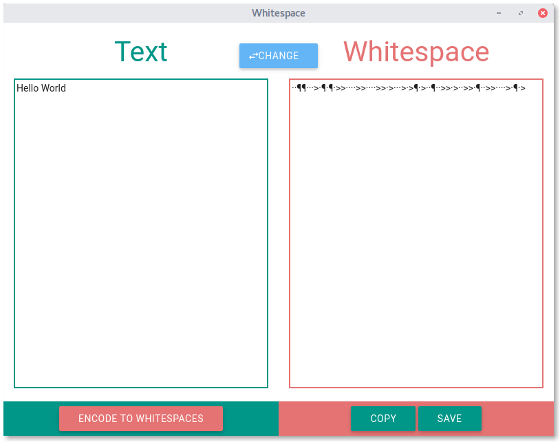

# Whitespace
~~What you see is what you get.~~

## What is Whitespace?
The most secure way to communicate would be if nobody knows that two people are communicating. Since this is impossible you can just try to hide the message. This technology is called [Steganography](https://en.wikipedia.org/wiki/Steganography "Wikipeda about Steganography"). Whitespace helps you to hide messages, by encoding them to a "code" which just contains invisible characters (Space, Tab, Linefeed). So every encoded file seems to be blank. 

Whitespace is build with [electron](http://electron.atom.io/). 

## How to use
Encoding isn't really save so you sould only hide encrypted messages if you want that your messages are secure. 

Since normal characters will be ignored by the alogrithm you can write text between the whitespaces like in this example. So the text looks like it is formatet wrong.

You can also add the whitespaces at the end of a code file like HTML, CSS or JS. 

## What is the current state?
This Software is currently in alpha. At its core Whitespace works just fine, so you can encode text to whitespaces and also decode it.

However, the app isn't ready yet. So for example there is no support for droping files or to encrypt the text and at the moment the app is also really ugly.

## How to install?
Since the app is so young there aren't any binarys or packages. 

However, you can build it on your system by yourself:

1. [Install node](https://nodejs.org/en/download/ "Go to the node website.") if you haven't done yet.
2. [Download](https://github.com/flofriday/Whitespace/archive/master.zip) this project and unzip it.
3. Open a terminal in the unziped folder.
4. Install [electron](http://electron.atom.io/) by typing `npm i electron-prebuilt`.
5. To start the app type `npm start`.

## How can I help?
You can review the app and write an [issue](https://github.com/flofriday/Whitespace/issues "Create a new issue") how I could improve Whitespace.
Or you can work on one of the problems below.

* [ ] Better UI (feel free to rewrite it from scratch)
* [ ] Encode whole files
* [ ] Add different encryptions
* [ ] Create a html file with a whitespace message at the end (add this file to /example/

