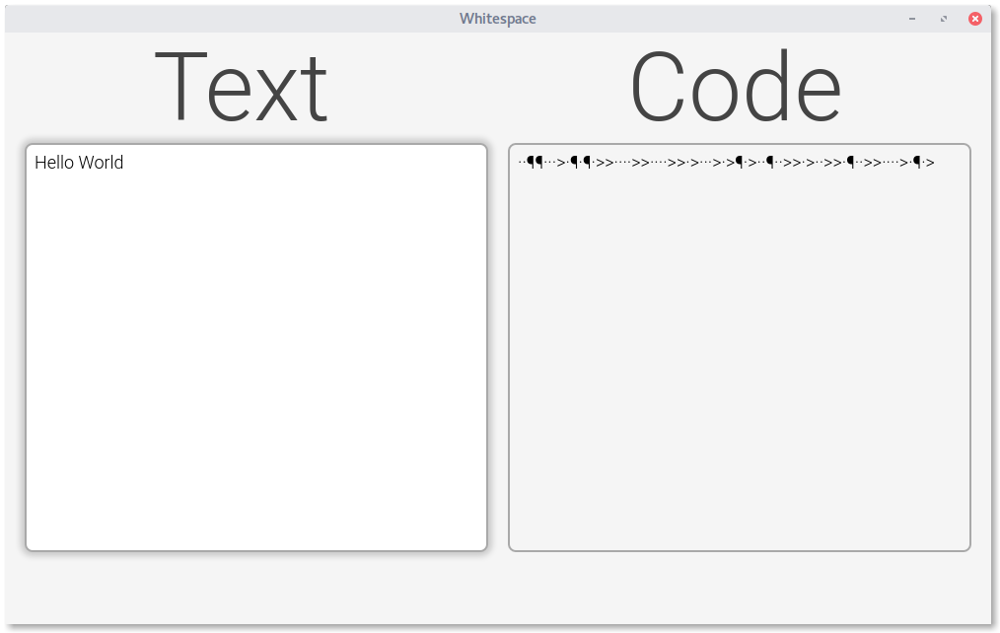

# Whitespace
~~What you see is what you get.~~

Built with [Electron](http://electron.atom.io/ "Click to learn more about Electron").

Download a [release](https://github.com/flofriday/Whitespace/releases "Click to see all releases.").

[More screenshots](screenshots/v0.0.2/Screenshots.md).
## Whitespace?
The most secure way to communicate would be if nobody knows that two people are communicating. Since this is impossible you can just try to hide the message. This technology is called [Steganography](https://en.wikipedia.org/wiki/Steganography "Wikipeda about Steganography"). Whitespace helps you to hide messages, by encoding them to a "code" which just contains invisible characters (Space, Tab, Linefeed). So every encoded file seems to be blank.

## Algorithm?
The Alogrithm is very simple. Every character is defined by [ASCII](https://en.wikipedia.org/wiki/ASCII), and is represented by a number. Now you have to convert this decimal number to a ternary number. This ternary number now contains only 0, 1 or 2. Every 0 will be replaced by a space, the 1 by a tab and every 2 by a linefeed.

	Example
    a = 97		//in decimal (ASCII)
    a = 010121	//in ternary
    a = ·>·>¶>	//in Whitespace code

## How to use?
Encoding isn't really save so you sould only hide encrypted messages if you want that your messages are secure.

Since normal characters will be ignored by the alogrithm you can write text between the whitespaces like in this example. So the text looks like it is formatet wrong.

You can also add the whitespaces at the end of a code file like HTML, CSS or JS.

## State?
This Software is currently in alpha. At its core Whitespace works just fine, so you can encode text to whitespaces and also decode it.

However, the app isn't ready yet. So for example there is no support for droping files or to encrypt the text. Also the UI isn't perfect but I'm working hard to create a nice Interface.

## How to install?
1. [Download](https://github.com/flofriday/Whitespace/releases/tag/v0.0.2-alpha) the rigth binary for your Computer.
2. Unzip the downloaded folder.
3. Start the executeable.

### Build it by your own
1. [Install node](https://nodejs.org/en/download/ "Go to the node website.") if you haven't done yet.
2. [Download](https://github.com/flofriday/Whitespace/archive/master.zip) this project and unzip it.
3. Open a terminal in the unziped folder.
4. Install all packages by typing `npm install`.
5. To start the app type `npm start`. You can also type `npm test` to open also the Chrome DevTools

## How can I help?
You can review the app and write an [issue](https://github.com/flofriday/Whitespace/issues "Create a new issue") how I could improve Whitespace.
Or you can work on one of these [problems](TODO.md "TODO.md").
