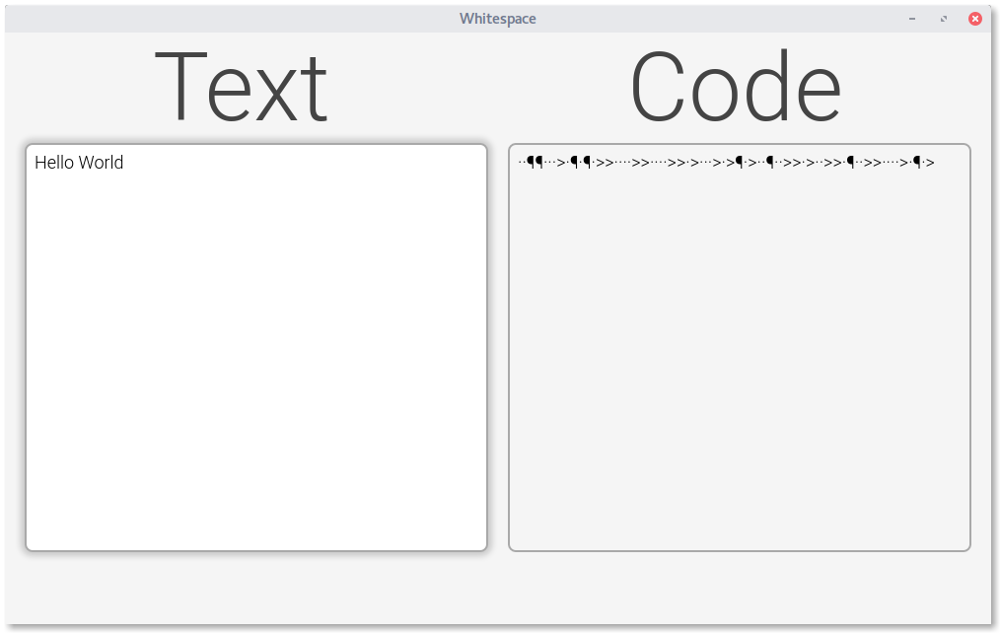

# Screenshots
Whitespace version: 0.0.2
## Mainscreen

This is the mainscreen when you open the app.

This is the mainscreeen with some Text to encode. On the right side you can see the content of the output visualized. So insteed of a space you see a dot. The tab is replaced by a '>' and the linefeed by a '¶'

This is the Mainscreen during the decoding of the message from the last picture.

Here you can see the context menu of Whitespace. 

## Settingsscreen

As you can see the Settingsscreen isn't ready in this version.

## Aboutscreen

The Aboutscreen is also not completed in this version.